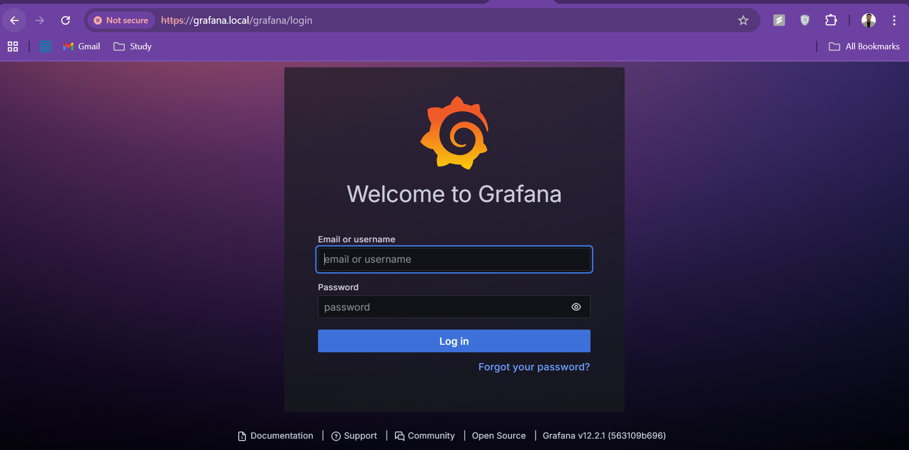
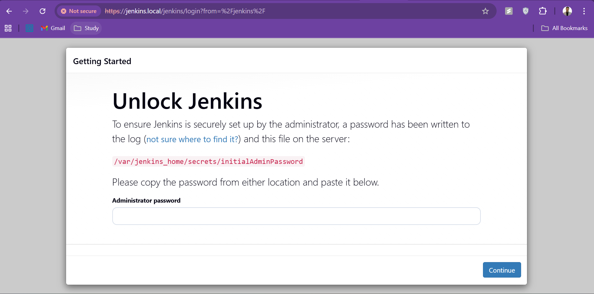

# 🔒 Secure Jenkins & Grafana Behind NGINX Reverse Proxy with SSL & Basic Auth (Docker Setup)

This guide shows you how to securely expose **Jenkins** and **Grafana** running in **Docker containers** behind **NGINX** using:

* ✅ Self-signed SSL certificates
* 🔐 Basic Authentication (per app)
* ⚙️ Reverse Proxy via HTTPS
* 🧠 Clean paths like

  * `https://jenkins.local/jenkins`
  * `https://grafana.local/grafana`

> 💡 Perfect for home-labs, VMs, or cloud setups (Azure/AWS) where you want **secure, isolated web access**.

---

## 🧭 Architecture Overview

```
Client (Browser)
     ↓ HTTPS + Basic Auth
[ NGINX Reverse Proxy :443 ]
├──> Jenkins container → http://127.0.0.1:8080/jenkins
└──> Grafana container → http://127.0.0.1:3000/grafana
```

**NGINX handles**

* SSL termination
* Basic authentication
* Reverse proxy routing

---

## ⚙️ Step 0: Prerequisites

✅ Ubuntu 24.04 (or compatible Linux VM)
✅ Docker & NGINX installed
✅ A public IP (for mapping in `/etc/hosts`)

### 🧩 Install all dependencies

```bash
sudo apt update && sudo apt install -y nginx apache2-utils docker.io
sudo systemctl enable --now docker nginx
```

---

## 🔧 Step 1: Generate Self-Signed SSL Certificate

```bash
sudo mkdir -p /etc/ssl/selfsigned
sudo openssl req -x509 -nodes -days 365 -newkey rsa:2048 \
  -keyout /etc/ssl/selfsigned/nginx-self.key \
  -out /etc/ssl/selfsigned/nginx-self.crt \
  -subj "/C=IN/ST=Karnataka/L=Bangalore/O=SelfSigned/OU=DevOps/CN=jenkins.local"
```

---

## 🔐 Step 2: Create Basic Auth Files

```bash
sudo mkdir -p /etc/nginx/auth

# For Jenkins
sudo htpasswd -cb /etc/nginx/auth/htpasswd_jenkins jenkinsadmin 'Jenkins@123'

# For Grafana
sudo htpasswd -cb /etc/nginx/auth/htpasswd_grafana grafanaadmin 'Grafana@123'
```

🧠 These protect your services before anyone even reaches Jenkins or Grafana.

---

## 🐳 Step 3: Run Jenkins & Grafana Containers

### ✅ Jenkins (with prefix `/jenkins`)

```bash
docker run -d \
  --name jenkins \
  -p 8080:8080 \
  -e JENKINS_OPTS="--prefix=/jenkins" \
  jenkins/jenkins:lts-jdk17
```

### ✅ Grafana

```bash
docker run -d \
  --name grafana \
  -p 3000:3000 \
  -e GF_SERVER_ROOT_URL="https://grafana.local/grafana" \
  grafana/grafana
```

Check:

```bash
docker ps
```

---

## 🌐 Step 4: Configure NGINX Reverse Proxy

Edit:

```bash
sudo vi /etc/nginx/sites-available/default
```

Replace contents with 👇

```nginx
# ===================================================
# 🔒 Secure Reverse Proxy for Jenkins & Grafana
# ===================================================

server {
    listen 443 ssl http2 default_server;
    listen [::]:443 ssl http2 default_server;
    server_name _;

    ssl_certificate     /etc/ssl/selfsigned/nginx-self.crt;
    ssl_certificate_key /etc/ssl/selfsigned/nginx-self.key;

    # ------------------------------
    # 🔸 Grafana - https://grafana.local/grafana
    # ------------------------------
    location /grafana/ {
        proxy_pass          http://127.0.0.1:3000/;
        proxy_set_header    Host $host;
        proxy_set_header    X-Real-IP $remote_addr;
        proxy_set_header    X-Forwarded-For $proxy_add_x_forwarded_for;
        proxy_set_header    X-Forwarded-Proto $scheme;

        auth_basic "Grafana Login";
        auth_basic_user_file /etc/nginx/auth/htpasswd_grafana;
    }

    # ------------------------------
    # 🔸 Jenkins - https://jenkins.local/jenkins
    # ------------------------------
    location /jenkins/ {
        proxy_pass          http://127.0.0.1:8080/jenkins/;
        proxy_set_header    Host $host;
        proxy_set_header    X-Real-IP $remote_addr;
        proxy_set_header    X-Forwarded-For $proxy_add_x_forwarded_for;
        proxy_set_header    X-Forwarded-Proto $scheme;

        proxy_http_version  1.1;
        proxy_request_buffering off;
        proxy_buffering     off;
        proxy_read_timeout  3600;

        # WebSocket support
        proxy_set_header    Upgrade $http_upgrade;
        proxy_set_header    Connection "upgrade";

        # Don't forward Basic Auth credentials
        proxy_set_header    Authorization "";

        auth_basic "Jenkins Login";
        auth_basic_user_file /etc/nginx/auth/htpasswd_jenkins;
    }
}

# ------------------------------
# Redirect HTTP → HTTPS
# ------------------------------
server {
    listen 80 default_server;
    listen [::]:80 default_server;
    server_name _;
    return 301 https://$host$request_uri;
}
```

---

## 🧪 Step 5: Test and Reload NGINX

```bash
sudo nginx -t
sudo systemctl reload nginx
```

✅ Output should say:

```
nginx: configuration file /etc/nginx/nginx.conf test is successful
```

---

## 💻 Step 6: Configure Windows Hosts File

On Windows, open Notepad as **Administrator**
and edit:

```
C:\Windows\System32\drivers\etc\hosts
```

Add:

```
4.240.89.179 grafana.local jenkins.local
```

Then flush DNS cache:

```cmd
ipconfig /flushdns
```

---

## 🚀 Step 7: Access Services

### 🧩 Jenkins

```
https://jenkins.local/jenkins/
```

🔐 Basic Auth → `jenkinsadmin / Jenkins@123`
Then unlock Jenkins:

```bash
docker exec -it jenkins cat /var/jenkins_home/secrets/initialAdminPassword
```

### 📊 Grafana

```
https://grafana.local/grafana/
```

🔐 Basic Auth → `grafanaadmin / Grafana@123`
Grafana Login → `admin / Grafana@123`

---

## 🔄 Step 8: Reset Grafana Password (Optional)

```bash
docker exec -it grafana grafana-cli admin reset-admin-password Grafana@123
docker restart grafana
```

---

## 🔍 Step 9: Verify with Curl

```bash
curl -k -I -u jenkinsadmin:'Jenkins@123' -H "Host: jenkins.local" https://127.0.0.1/jenkins/
curl -k -I -u grafanaadmin:'Grafana@123' -H "Host: grafana.local" https://127.0.0.1/grafana/
```

✅ Should return `302` or `200 OK`

---

## 🧰 Troubleshooting

| Issue                     | Cause                                 | Fix                                                         |
| ------------------------- | ------------------------------------- | ----------------------------------------------------------- |
| ❌ 401 Unauthorized        | NGINX forwarded Basic Auth to Jenkins | Add `proxy_set_header Authorization "";`                    |
| ❌ 404 Not Found           | Jenkins missing prefix                | Add `--prefix=/jenkins` and use `/jenkins/` in `proxy_pass` |
| 🔁 Grafana login loop     | Wrong root URL                        | Set `GF_SERVER_ROOT_URL="https://grafana.local/grafana"`    |
| ⚠️ Browser invalid cert   | Self-signed SSL                       | Click “Advanced → Proceed”                                  |
| 🧭 Hostname not resolving | Missing hosts entry                   | Add in Windows `/etc/hosts`                                 |

---

## 🧱 Final Verification Checklist

✅ `https://jenkins.local/jenkins` → Basic Auth → Jenkins Login
✅ `https://grafana.local/grafana` → Basic Auth → Grafana Login
✅ SSL working
✅ Separate Basic Auth per app
✅ Docker containers isolated & healthy

---

## 🧾 Summary

| Component | Role                     | URL                                                            |
| --------- | ------------------------ | -------------------------------------------------------------- |
| Jenkins   | CI/CD Automation         | [https://jenkins.local/jenkins](https://jenkins.local/jenkins) |
| Grafana   | Monitoring & Dashboards  | [https://grafana.local/grafana](https://grafana.local/grafana) |
| NGINX     | SSL, Auth, Reverse Proxy | :443 (HTTPS)                                                   |

---

# 🧩 Bonus Security Hardening for Jenkins via NGINX

1️⃣ **IP-based Access Control** (restrict Jenkins to your home/office IP)
2️⃣ **Rate Limiting** (throttle abusive or brute-force requests)

We’ll modify your `/etc/nginx/sites-available/default` to include:

* **IP Restriction:** Allow only your trusted IP(s)
* **Rate Limiting:** Limit number of requests per IP

---

## 🔐 Step 10: Restrict Access to Jenkins by IP

Edit NGINX config:

```bash
sudo vi /etc/nginx/sites-available/default
```

Inside your existing Jenkins block, **add** these two directives
**right after** the `location /jenkins/ {` line 👇

```nginx
    # -------------------------------------------
    # 🔒 IP Restriction for Jenkins
    # -------------------------------------------
    # Replace YOUR_IP_RANGE with your trusted IP(s)
    # Example: allow 103.25.122.58; OR allow 103.25.122.0/24;
    allow 103.25.122.0/24;
    deny all;
```

👉 Example full section with context:

```nginx
# ------------------------------
# 🔸 Jenkins - https://jenkins.local/jenkins
# ------------------------------
location /jenkins/ {
    # Allow only your office/home IP range
    allow 103.25.122.0/24;
    deny all;

    proxy_pass          http://127.0.0.1:8080/jenkins/;
    proxy_set_header    Host $host;
    proxy_set_header    X-Real-IP $remote_addr;
    proxy_set_header    X-Forwarded-For $proxy_add_x_forwarded_for;
    proxy_set_header    X-Forwarded-Proto $scheme;

    proxy_http_version  1.1;
    proxy_request_buffering off;
    proxy_buffering     off;
    proxy_read_timeout  3600;

    # WebSocket support
    proxy_set_header    Upgrade $http_upgrade;
    proxy_set_header    Connection "upgrade";

    # Don't forward Basic Auth credentials
    proxy_set_header    Authorization "";

    auth_basic "Jenkins Login";
    auth_basic_user_file /etc/nginx/auth/htpasswd_jenkins;
}
```

🧠 **How it works:**

* `allow 103.25.122.0/24;` → only this IP range can access Jenkins
* `deny all;` → everyone else gets `403 Forbidden`

Test it with curl from another IP, you’ll see:

```bash
curl -k -I -H "Host: jenkins.local" https://your_vm_ip/jenkins/
# => HTTP/1.1 403 Forbidden
```

---

## ⚙️ Step 11: Implement Rate Limiting for Jenkins

Now let’s protect Jenkins from brute-force or DDoS-style abuse.
We’ll use NGINX’s built-in **`limit_req_zone`** and **`limit_req`** directives.

### 1️⃣ Define a rate limit zone (in `http` block)

Open main NGINX config:

```bash
sudo vi /etc/nginx/nginx.conf
```

Find the top `http {` block, and **add this line inside it** (anywhere near the top):

```nginx
http {
    ##
    # Rate limit zone (10 MB shared memory, 5 req/sec per IP)
    ##
    limit_req_zone $binary_remote_addr zone=jenkins_limit:10m rate=5r/s;

    include /etc/nginx/mime.types;
    default_type application/octet-stream;
    ...
```

This creates a memory zone named `jenkins_limit` where NGINX tracks requests per IP.

---

### 2️⃣ Apply the limit inside Jenkins location

Now go back to:

```bash
sudo vi /etc/nginx/sites-available/default
```

Add this **inside** the `location /jenkins/ { ... }` block
(near the top, right below the IP restriction):

```nginx
    # -------------------------------------------
    # 🚦 Rate Limiting for Jenkins
    # -------------------------------------------
    # Allow bursts of 10 requests, then 5 req/sec per IP
    limit_req zone=jenkins_limit burst=10 nodelay;
```

👉 Full section after applying both features:

```nginx
location /jenkins/ {
    # Allow only your office/home IP range
    allow 103.25.122.0/24;
    deny all;

    # Rate limiting
    limit_req zone=jenkins_limit burst=10 nodelay;

    proxy_pass          http://127.0.0.1:8080/jenkins/;
    proxy_set_header    Host $host;
    proxy_set_header    X-Real-IP $remote_addr;
    proxy_set_header    X-Forwarded-For $proxy_add_x_forwarded_for;
    proxy_set_header    X-Forwarded-Proto $scheme;

    proxy_http_version  1.1;
    proxy_request_buffering off;
    proxy_buffering     off;
    proxy_read_timeout  3600;

    proxy_set_header    Upgrade $http_upgrade;
    proxy_set_header    Connection "upgrade";
    proxy_set_header    Authorization "";

    auth_basic "Jenkins Login";
    auth_basic_user_file /etc/nginx/auth/htpasswd_jenkins;
}
```

---

## 🔍 Step 12: Test & Reload

Validate syntax:

```bash
sudo nginx -t
```

If output is clean:

```bash
sudo systemctl reload nginx
```

Now test:

```bash
# Flood Jenkins to test rate limit
for i in {1..20}; do
  curl -k -I -u jenkinsadmin:'Jenkins@123' -H "Host: jenkins.local" https://127.0.0.1/jenkins/ &
done
wait
```

You should see some responses returning:

```
HTTP/1.1 503 Service Temporarily Unavailable
```

That means **rate limiting is working!**

---

## ✅ Final Security Summary

| Feature            | Directive                     | Description                     |
| ------------------ | ----------------------------- | ------------------------------- |
| **IP Restriction** | `allow` / `deny`              | Limits access to trusted IP(s)  |
| **Rate Limiting**  | `limit_req_zone`, `limit_req` | Caps requests per second per IP |
| **Basic Auth**     | `auth_basic`                  | Protects UI with password       |
| **SSL**            | `ssl_certificate`             | Encrypts traffic end-to-end     |

---

## 💡 Bonus Tip: Log Violations

You can track denied or throttled requests via logs:

```bash
sudo tail -f /var/log/nginx/error.log
```

Entries like:

```
limiting requests, excess: 5.000 by zone "jenkins_limit"
access forbidden by rule, client: 52.95.213.12
```

---

# Screenshots of grafana and jenkins with https

**Grafana**


**Jenkins**
